<div align="center">

</div>

<div align="center">

[;🤖+Building+AI-Powered+Healthcare+Solutions;🚀+Creator+of+QuickMate+%26+VaidyaVaani;⚡+Turning+Ideas+into+Scalable+Products;🌱+Always+Learning%2C+Always+Shipping!)](https://git.io/typing-svg)

</div>

<br/>

<p align="center">
  <a href="https://www.linkedin.com/in/saksham-gupta-6270ab296/"></a>
  <a href="mailto:samfgst3@gmail.com"></a>
  <a href="https://github.com/S-AM-GUPTA"></a>
  
</p>

<br/>

---


## 🧑‍💻 `whoami`

```bash
┌──(saksham㉿dev)-[~]
└─$ cat about.json

{
  "name"     : "Saksham Gupta",
  "role"     : "Full Stack Developer",
  "location" : "India 🇮🇳",
  "education": "B.Sc. CS → MCA",

  "stack"    : {
    "frontend"  : ["React", "Next.js", "TypeScript"],
    "backend"   : ["Node.js", "Express.js"],
    "database"  : ["MongoDB", "MySQL"],
    "exploring" : ["AI/ML", "Docker", "AWS"]
  },

  "building" : [
    "QuickMate  — Hyper-local task marketplace 🤝",
    "VaidyaVaani — AI healthcare assistant 🏥"
  ],

  "openTo"   : "Full Stack Roles & Collaborations",
  "contact"  : "samfgst3@gmail.com"
}
```

<br clear="right"/>

---

<br/>

## ⚡ What Drives Me

<table>
<tr>
<td>

🔥 **Passionate** about building products people actually use

🏥 **Healthcare tech** believer — VaidyaVaani is my mission

🤝 **Community first** — QuickMate connects real neighbors

💡 **Clean code** advocate — readable > clever

📈 **90-day challenger** — shipping every single day

🤖 **AI explorer** — integrating intelligence into every product

</td>
<td>

```text
🏆 Projects Shipped     : 4+
⭐ Repos on GitHub      : 8+
📅 Days of Coding       : 90+
☕ Cups of Coffee       : ∞
🐛 Bugs Fixed Today     : Many
🚀 Currently Building   : 2
```

</td>
</tr>
</table>

<br/>

---

## 🛠️ Tech Arsenal

<div align="center">

**Frontend**


**Backend & Database**


**Tools & DevOps**


</div>

<br/>

---

## 🌟 Flagship Projects

<div align="center">
<table>
<tr>
<td align="center" width="50%">


**Hyper-local Community Task Marketplace**

Connect with trusted neighborhood "Mates" for errands, tasks & local services. Built on **trust, proximity & community**.

`TypeScript` `React` `Node.js` `MongoDB`

[](https://github.com/S-AM-GUPTA/QuickMate)

</td>
<td align="center" width="50%">


**AI-Powered Healthcare Voice Assistant**

Multilingual medical guidance for everyone. Bridging the gap between patients & healthcare using the power of **AI + Voice**.

`JavaScript` `Node.js` `Express` `MongoDB`

[](https://github.com/S-AM-GUPTA/VaidyaVaani)

</td>
</tr>
<tr>
<td align="center" width="50%">


**Personal Developer Portfolio**

Showcasing projects, skills & journey as a full-stack developer. Built with **Next.js, TypeScript & Tailwind**.

`Next.js` `TypeScript` `Tailwind CSS`

[](https://github.com/S-AM-GUPTA/Portfolio)

</td>
<td align="center" width="50%">


**90 Days of Web Development**

A complete, daily record of my web dev journey — frontend, backend & full-stack with **daily notes & code**.

`HTML` `CSS` `JavaScript` `React`

[](https://github.com/S-AM-GUPTA/90daysOfWebDevelopment)

</td>
</tr>
</table>
</div>

<br/>

---

## 🏆 Achievements

<div align="center">


</div>

<br/>

---

## 📊 GitHub Analytics

<div align="center">


</div>

<div align="center">


</div>

<div align="center">

</div>

<br/>

---

## 📈 Contribution Graph

<p align="center">
  
</p>

<br/>

---

## 🎯 2026 Roadmap

<div align="center">

| 🎯 Goal | Status |
|--------|--------|
| 🚀 Launch **QuickMate** MVP | 🔄 In Progress |
| 🏥 Deploy **VaidyaVaani** with AI | 🔄 In Progress |
| ⚛️ Master Advanced React & Next.js | 🔄 In Progress |
| 🐳 Learn Docker & CI/CD Pipelines | 🔄 Learning |
| ☁️ AWS Cloud Practitioner Cert | ⬜ Upcoming |
| 🧠 Contribute to Open Source | ⬜ Upcoming |
| 🔐 Learn System Design & Architecture | ⬜ Upcoming |
| 💼 Land a Full Stack Developer Role | 🎯 **Main Goal** |

</div>

<br/>

---

## 🕹️ Snake Eating My Contributions

<p align="center">
  
</p>

<br/>

---

<div align="center">

### 💬 Today's Dev Wisdom
[](https://github.com/piyushsuthar/github-readme-quotes)

<br/>

### 🤝 Let's Build Something Amazing Together!

*Open to Full Stack Roles, Freelance Projects & Open Source Collaborations*

**📬 samfgst3@gmail.com**

<br/>


</div>
